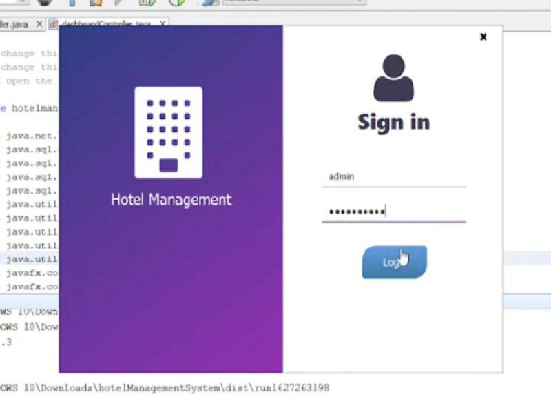
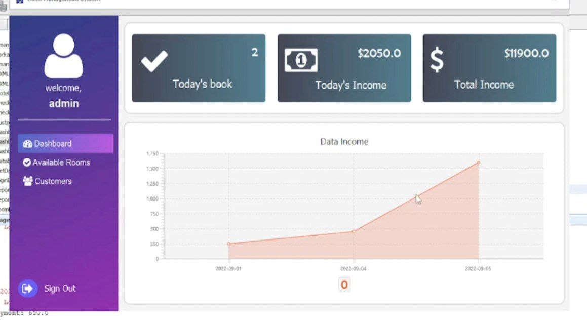
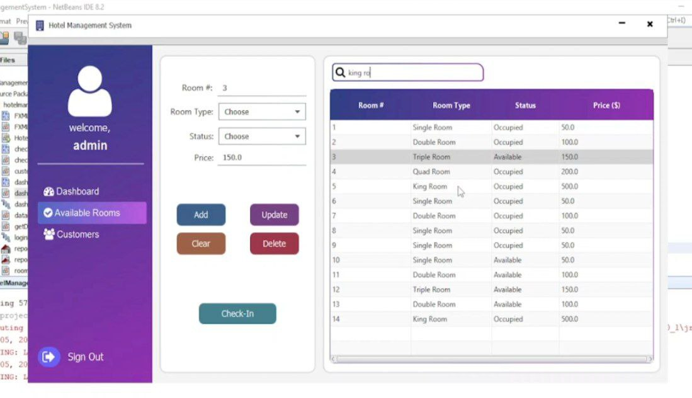
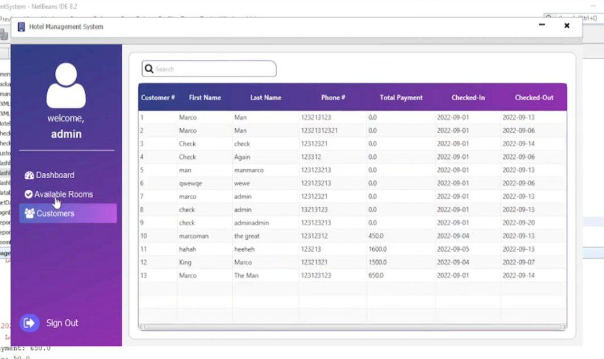

# 🏨 GUI Hotel Management System

A JavaFX desktop application for managing hotel room bookings, customers, check-ins/outs, and daily revenue tracking.

---

---

## 📸 Screenshots

| Login | Dashboard |
|:---:|:---:|
|  |  |
| **Login Screen** | **Dashboard Overview** |

| Rooms | Customers |
|:---:|:---:|
|  |  |
| **Room Management** | **Customer Records** |

---

## ✨ Features

### 🛏️ Room Management
- Add rooms based on **type** and **status**
- Supported room types: **Single / Double / Triple / Quad**
- Room status tracking: **Available / Occupied**
- Full **CRUD** operations — Add, Edit, Update, Delete

### 👥 Customer Management
- View all customers in a dedicated page
- Track **Check-in date** for each customer
- Track **expected Check-out date**
- Complete customer history

### ✅ Check-in / Check-out
- Perform **Check-in** and **Check-out** operations
- Automatically updates room status on action

### 📊 Dashboard
- 💰 **Total Revenue** overview
- 📅 **Today's bookings** count
- 💵 **Today's revenue** figures

---

## 🛠️ Tech Stack

| Layer | Technology |
|:---|:---|
| 🖥️ UI Framework | JavaFX |
| 🎨 Layout | FXML |
| 💅 Styling | CSS |
| 🗄️ Database | MySQL |

---

## 📌 Project Status

> ✅ **Completed** &nbsp;&nbsp;|&nbsp;&nbsp; 🔒 **Source Code: Private**

---

*Made with 🏨 by Youssef Hesham*

